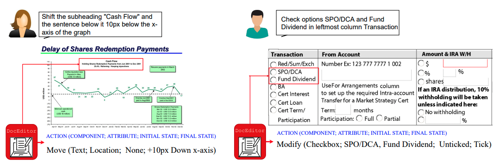

# DocEdit: Language-guided Document Editing (AAAI 2023)

[Puneet Mathur](https://themadaiguy.github.io/) | [Rajiv Jain](https://research.adobe.com/person/rajiv-jain/) | [Jiuxiang Gu](https://research.adobe.com/person/jiuxiang-gu/) | [Franck Dernoncourt](https://research.adobe.com/person/franck-dernoncourt/) | [Dinesh Manocha](https://www.cs.umd.edu/people/dmanocha) | [Vlad I. Morariu](https://research.adobe.com/person/vlad-morariu/)

### Abstract

Professional document editing tools require a certain level of expertise to perform complex edit operations. To make editing 
tools accessible to increasingly novice users, we investigate intelligent document assistant systems that can make or suggest
edits based on a user’s natural language request. Such a system should be able to understand the user’s ambiguous requests
and contextualize them to the visual cues and textual content found in a document image to edit localized unstructured text
and structured layouts. To this end, we propose a new task of language-guided localized document editing, where the user
provides a document and an open vocabulary editing request, and the intelligent system produces a command that can be
used to automate edits in real-world document editing software. In support of this task, we curate the DocEdit dataset, a
collection of approximately 28K instances of user edit requests over PDF and design templates along with their corresponding
ground truth software executable commands. To our knowledge, this is the first dataset that provides a diverse mix of edit
operations with direct and indirect references to the embedded text and visual objects such as paragraphs, lists, tables, etc. We
also propose DocEditor, a Transformer-based localizationaware multimodal (textual, spatial, and visual) model that
performs the new task. The model attends to both document objects (e.g., paragraphs, images) and related text contents
which may be referred to in a user edit request, generating a multimodal embedding that is used to predict an edit command and
associated bounding box localizing it. Our proposed model empirically outperforms other baseline deep learning approaches
by 15-18%, providing a strong starting point for
future work.

# Dataset

This is a partial release of the Adobe Research DocEdit Dataset described in our AAAI 2023 paper. The current release includes
the original image, the user request, and the output command for the training and validation splits of the DocEdit-PDF subset
of the DocEdit Dataset. The dataset can be accessed [here](https://github.com/adobe-research/DocEdit-Dataset/releases/tag/v1.0).

# License
 
The [Enron Email Data](https://aws.amazon.com/datasets/enron-email-data/) and government forms are in the public domain or are
licensed under their respective licenses (as applicable).  All other materials, including the modifications made to the
original documents (if provided) and the descriptions of the modifications which include the natural language description and
the structured command-like descriptions that include the bounding boxes, etc., are licensed under the
[Adobe Research DocEdit Dataset License, Version 1.0](./LICENSE).

# Citation

If you use our dataset, please cite us using the following bibtex:

>@InProceedings{Mathur_2023_AAAI,  
>author = {Mathur, Puneet and Jain, Rajiv and Gu, Jiuxiang and Dernoncourt, Franck and Manocha, Dinesh and Morariu, Vlad},  
>title = {DocEdit: Language-guided Document Editing},  
>booktitle = {Thirty-Seventh AAAI Conference on Artificial Intelligence (AAAI)},  
>year = {2023},  
>}
